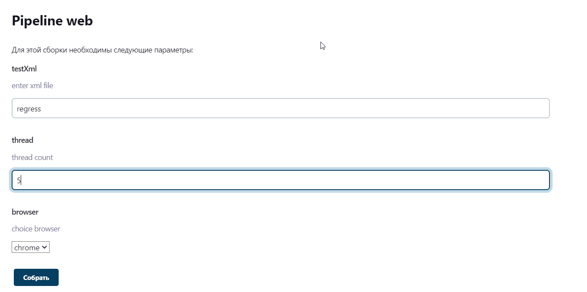
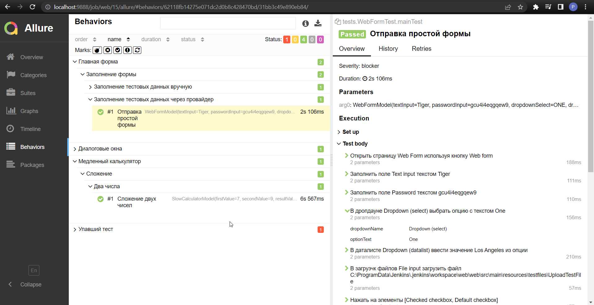
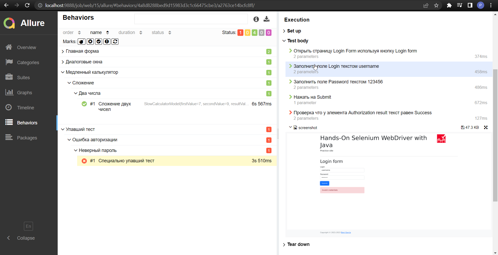
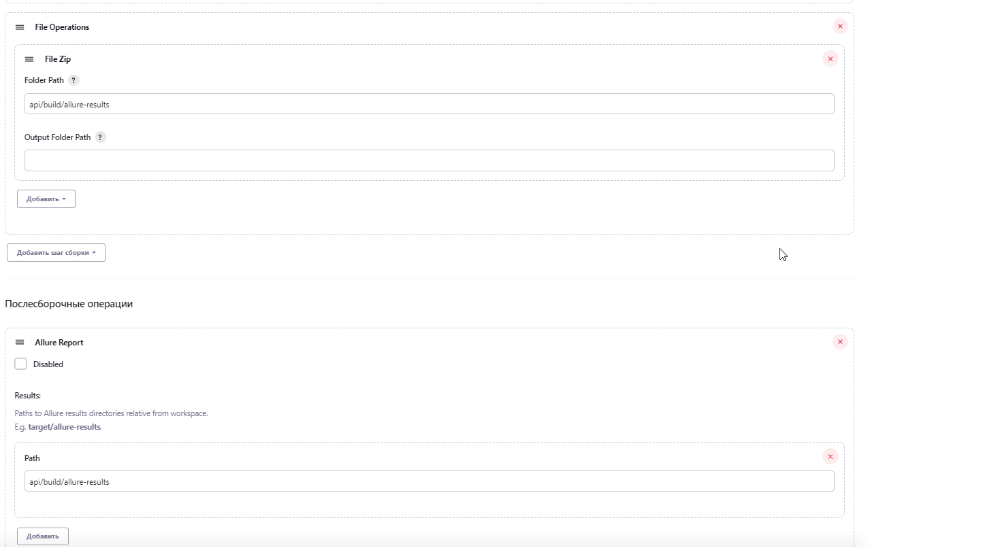
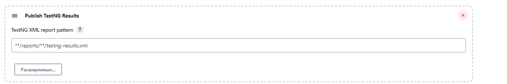
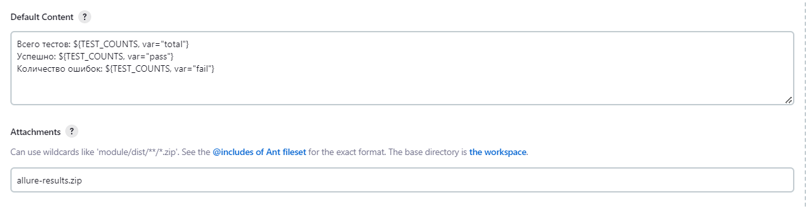
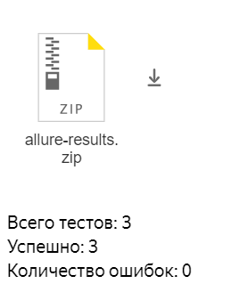
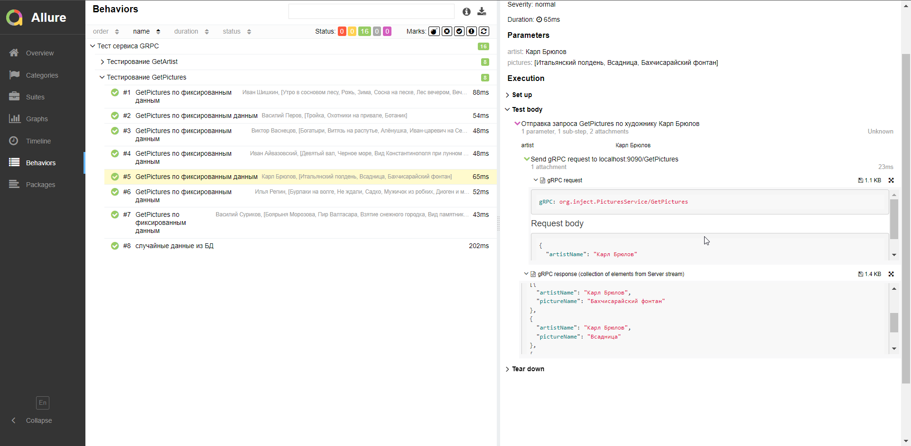

# inJect
JAVA
## Содержание

> ► [Введение](#введение)
>
>► [Web/UI](#web)
>
>► [API](#api)
>
>► [GRPC JDBCTemplate](#grpc-jdbctemplate)


## Введение

Проект по автоматизации тестирования. Состоит из трех основных модулей: <code> web, api, grpc.</code>
Каждый модуль следует рассматривать как отдельный проект, независимо от другого.
Цель проекта - эксперимент. Попытка создать свои проекты по автоматизации.
Найти лучшие решения в возможных ситуациях. А для того, чтобы решения находить нужно использовать как можно больше инструментов и подходов.

**ВАЖНО! В проектах сознательно используются разные технологии, подходы и разные способы реализации идей.**

Подходы, используемые в модулях можно комбинировать между собой, что автор и попытался сделать.
В данной части приведена конкретная информация по запуску модулей проекта. Каждый модуль проверяет свою сферу. Причем делает это своим способом, где-то используется TestFactory, где-то DataProvider, где-то тестовые данные зафиксированные, где-то случайные.
Где-то удаленная конфигурация осуществляется через дженкинсфайл, где-то через свободную конфигурацию. Это сделано **специально**, чтобы показать возможности проекта и найти лучшее сочетание. В случае, необходимости те или иные приемы можно свободно переносить из одного модуля в другой.

## Web
Сайт для тестирования https://bonigarcia.dev/selenium-webdriver-java/
Web form, Slow Calculator, Dialog Boxes.
В случае падения теста, к отчету добавляется скриншот.
> ### Стэк
> Selenium, Spring, Selenoid, TestNG, Allure, Jenkins, Gradle
### Локальный запуск
Для запуска стандартного регресс теста нужно ввести команду.
```sh
./gradlew :web:testByXml
```

Тестовый запуск можно дополнительно настроить
```sh
./gradlew :web:testByXml -Premote={boolean, запускается ли тест удаленно}
-PtestXml={наименование xml файла testng, находящегося по пути ./src/test/resources/testngxmls/}
-Pthread={количество потоков}
-Pbrowser={наименование браузера chrome, firefox, edge}
```

### Удаленный запуск
```Jenkinsfile``` модуля описывает способ запуска автотестов.
Параметры сборки

Успешный тест

Упавший тест

## API
Сайт для тестирования https://petstore.swagger.io/v2/
Создание, регистрация, получение информации по User.
После теста приходит email с аллюр отчетом и информацией о тестах.
> ### Стэк
> RestAssured, Jackson, TestNG, Allure, Jenkins, Gradle
### Локальный запуск
Для запуска всех тестов нужно ввести команду.
```sh
./gradlew :api:allApi
```

### Удаленный запуск
Настройка осуществлялась со свободной конфигурацией

Настройка. Архивируем аллюр отчет.


Настройка. Собираем информацию о тестах для сообщения


Настройка. В блоке Editable Email Notification


Сообщение на почте




## GRPC JDBCTemplate
Сервис для тестирования собирается из докерфайла модуля.
Полностью система собирается из ```docker-compose.yml``` модуля
> ### Стэк
> Spring, TestNG, Allure, Jenkins, Gradle
### Запуск сервиса
Толстый jar можно собрать
```sh
./gradlew :grpc:jar
```
запустить контейнер можно
```sh
docker-compose -f grpc\\docker-compose.yml up -d
```

### Запуск тестов
Для запуска всех тестов нужно ввести команду.
```sh
./gradlew :grpc:test
```

### Удаленный запуск
```Jenkinsfile``` модуля описывает способ запуска автотестов.
Результаты теста

